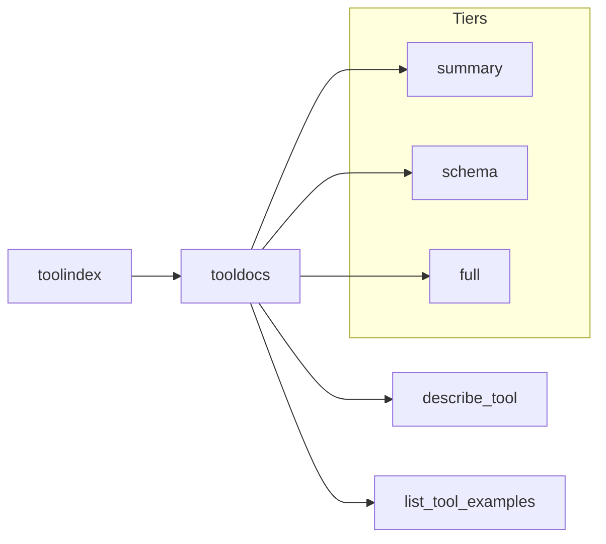

# Architecture

`tooldocs` adds a documentation layer on top of `toolmodel`.
It does not change schemas; it augments them with guidance and examples.

## Resolution

`tooldocs` can resolve tools in two ways:

- via `toolindex.Index` (preferred)
- via a custom `ToolResolver` function
