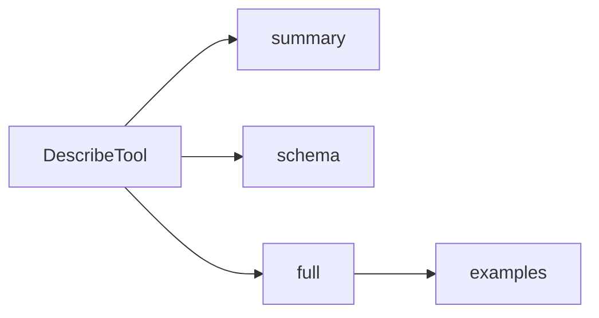
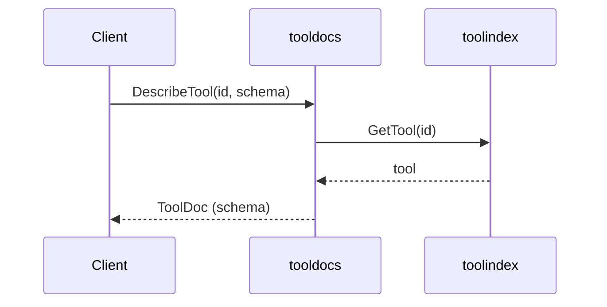

# Architecture

`tooldocs` adds a documentation layer on top of `toolmodel`.
It does not change schemas; it augments them with guidance and examples.

## Tiered disclosure

## Resolution sequence

## Progressive disclosure contract

- `DetailSummary`: short text only
- `DetailSchema`: full tool + derived schema info
- `DetailFull`: schema + notes + examples

## Resolution modes

- via `toolindex.Index` (preferred)
- via a custom `ToolResolver` function
