# User Journey

This journey shows how `tooldocs` provides progressive disclosure in an end-to-end agent workflow.

## End-to-end flow (stack view)

```mermaid
%%{init: {'theme': 'base', 'themeVariables': {'primaryColor': '#d69e2e', 'primaryTextColor': '#fff'}}}%%
flowchart TB
    subgraph discovery["Phase 1: Discovery"]
        Search["🔍 search_tools(query)"]
        Summaries["📋 Summary[]<br/><small>ID, Name, Tags only</small>"]
    end

    subgraph schema["Phase 2: Schema"]
        DescSchema["📐 describe_tool(id, 'schema')"]
        SchemaDoc["📚 ToolDoc<br/><small>+ InputSchema<br/>+ OutputSchema</small>"]
    end

    subgraph full["Phase 3: Full"]
        DescFull["📖 describe_tool(id, 'full')"]
        FullDoc["📚 ToolDoc<br/><small>+ Notes<br/>+ Examples<br/>+ ExternalRefs</small>"]
    end

    subgraph examples["Examples"]
        ListEx["💡 list_tool_examples(id)"]
        ExList["📋 ToolExample[]<br/><small>Args + ResultHint</small>"]
    end

    subgraph execution["Phase 4: Execute"]
        Run["▶️ run_tool(id, args)"]
    end

    Search --> Summaries
    Summaries -->|"select tool"| DescSchema --> SchemaDoc
    SchemaDoc -->|"need guidance"| DescFull --> FullDoc
    SchemaDoc -->|"need examples"| ListEx --> ExList
    SchemaDoc --> Run
    FullDoc --> Run
    ExList --> Run

    style discovery fill:#3182ce,stroke:#2c5282
    style schema fill:#d69e2e,stroke:#b7791f,stroke-width:2px
    style full fill:#6b46c1,stroke:#553c9a
    style examples fill:#e53e3e,stroke:#c53030
    style execution fill:#38a169,stroke:#276749
```




### Detail Levels

```mermaid
%%{init: {'theme': 'base', 'themeVariables': {'primaryColor': '#6b46c1'}}}%%
flowchart LR
    subgraph summary["DetailSummary"]
        S["📋 1-2 line description<br/>🏷️ Tags<br/>📁 Namespace"]
    end

    subgraph schema["DetailSchema"]
        SC["📋 Full description<br/>📐 Input schema<br/>📤 Output schema"]
    end

    subgraph full["DetailFull"]
        F["📋 Everything<br/>📝 Notes<br/>💡 Examples<br/>🔗 ExternalRefs"]
    end

    summary -->|"~50 tokens"| schema -->|"~200 tokens"| full

    style summary fill:#38a169,stroke:#276749
    style schema fill:#d69e2e,stroke:#b7791f
    style full fill:#6b46c1,stroke:#553c9a
```



## Step-by-step

1. **Discovery**: agent finds candidate tools via `search_tools`.
2. **Schema retrieval**: agent requests `detail_level="schema"` to see required parameters.
3. **Full guidance**: agent requests `detail_level="full"` or `list_tool_examples` when extra guidance is needed.
4. **Execution**: agent calls the tool using `toolrun` with validated args.

## Example: register docs and fetch

```go
store := tooldocs.NewInMemoryStore(tooldocs.StoreOptions{Index: idx})

_ = store.RegisterDoc("github:create_issue", tooldocs.DocEntry{
  Summary: "Create a GitHub issue.",
  Notes:   "Use labels sparingly; title is required.",
  Examples: []tooldocs.ToolExample{
    {
      Title:       "Create a bug issue",
      Description: "Create a bug ticket with a label.",
      Args: map[string]any{
        "owner": "acme",
        "repo": "app",
        "title": "Crash on login",
        "labels": []any{"bug"},
      },
      ResultHint: "Returns the issue number and URL.",
    },
  },
})

doc, _ := store.DescribeTool("github:create_issue", tooldocs.DetailFull)
```

## Expected outcomes

- Clear, compact guidance without shipping the full schema by default.
- Predictable errors when docs are missing or a tool cannot be resolved.
- Examples that are safe to include in LLM context.

## Common failure modes

- `ErrNoTool` when requesting schema/full without tool registration.
- `ErrArgsTooLarge` when example payloads exceed caps.
- `ErrInvalidDetail` for invalid detail levels.
